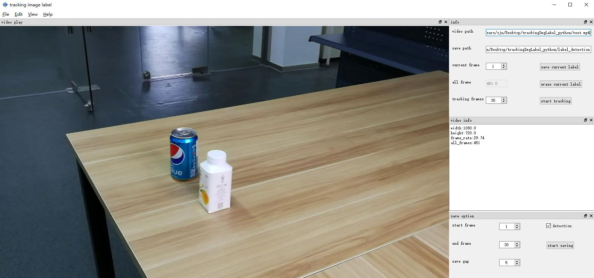
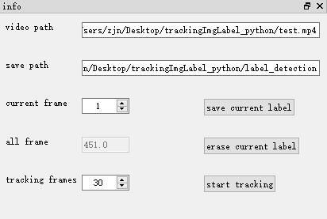
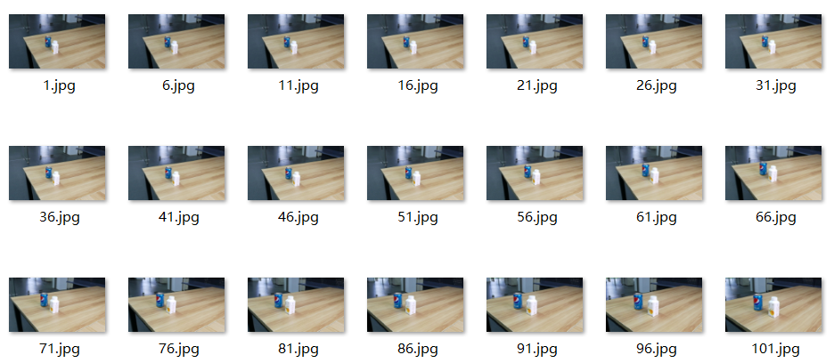
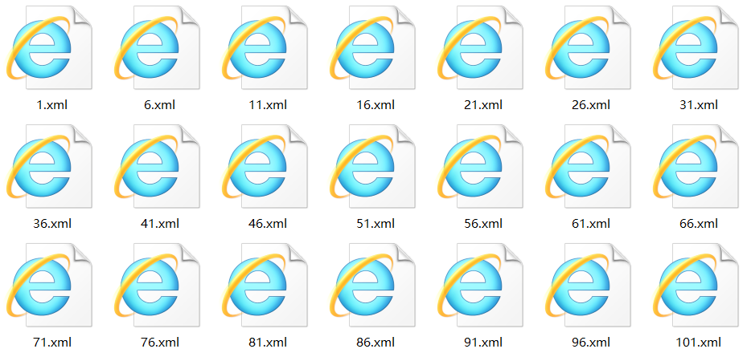
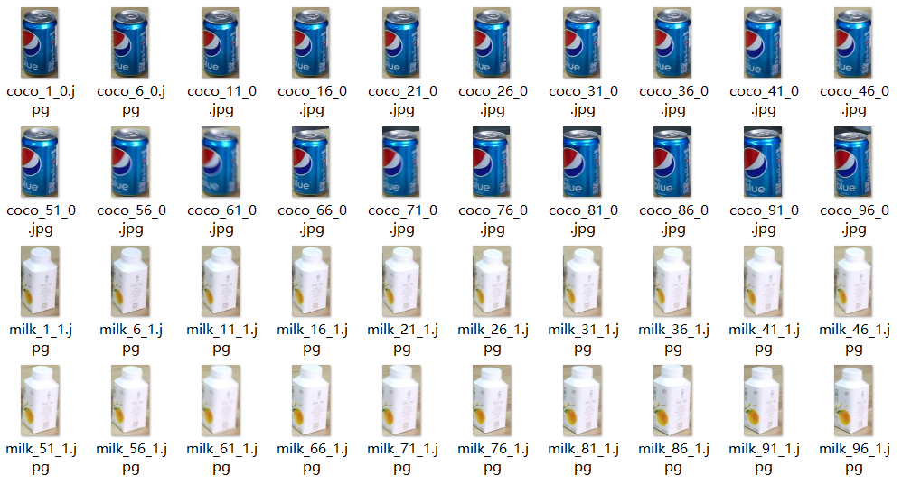

# **trackingImgLabel**
----------------------
TrackingImgLabel is an automatic image annotation tool with video input, which uses tracking algorithm to track the object. You can label the first frame of the video, then the tracking algorithm will automatically track the objects.  
Written in **python3.5**, using **opencv3** and **PyQt5**.  
Annotations can be both saved as XML files in PASCAL VOC format**(object detection task)** and classification images**(classification task)**
The **tracking method** we used is KCF(if you want to improve the result, change a better tracking algorithm)  

  

## Installation
-------------------
### Ubuntu
tested in ubuntu16.04, anaconda3-4.1.1.   
link:[[download anaconda]](https://repo.continuum.io/)   
after you installed anaconda(PyQt5 included), you must continue install opencv3 by the following commands    
`PATH_TO_CONDA/pip install opencv-python`   
`PATH_TO_CONDA/pip install numpy --upgrade`   
`PATH_TO_CONDA`refer to anaconda3/bin path   

if you don't use conda environment, you must install some frequently-used libs, especially `PyQt5`、`opencv`   
`sudo apt-get install python3-pyqt5`  
`pip install opencv-python`  
`pip install numpy --upgrade`

### Windows
tested in Windows10, annaconda3-4.1.1  
link:[[download opencv3]](https://www.lfd.uci.edu/~gohlke/pythonlibs/#opencv)  
then in anaconda env, use pip to install opencv3, and upgrade numpy   
`pip install numpy --upgrade`

### Download prebuilt binaries
tested in windows10, use the software directly  
link:[[download exe]](https://pan.baidu.com/s/1lxbdsljSyW_AI7G6sXqJnw)  
`password: 2f07`

### Notes
1. make sure not to contain the Chinese path

## Usage
-------------------
1. replace label.txt with your own classes  

2. open a video  

3. choose the output folder

4. in the video play dock

  

   
click left button to choose object(you can choose several objects at the same time)

5. info dock  

  

   

`current frame:`current operation frame, displayed in left   

`tracking frames:`the number of frames to track

`save current label:`save current frame's label to memory  

`erase current label:`erase current frame's label then you can re-label current frame  

`start tracking:`track start from `current frame` to `current frame + tracking frames`
after finishing tracking, you can change `current frame` value to check annotation, if not satisfying you can erase current frame's label and continue to re-label    

6. video info  

  

  
show video's infomation   

7. save option   

  

   

`start frame:`start frame when saving  

`end frame:`end frame when saving  

`save gap:`save a frame every **gap** frames because of redundancy of the video  

`detection:`saving mode, if selected it will save XML format for **object detection**(label_detection folder, generate JPEGImages for images storage and Annotations for xml storage), otherwise save classification frames for **classification**(label_class folder, generate Images for images storage and a label_train.txt)  

`start saving:`start saving the result   
**object detection result**   

      
  

     

**classification result**   

  

    

## License   
Free software: [license](LICENSE)   

## Contact   
if you have any question you can contact me:   
**186368@zju.edu.cn**   or   **zhangzjn@qq.com**  
